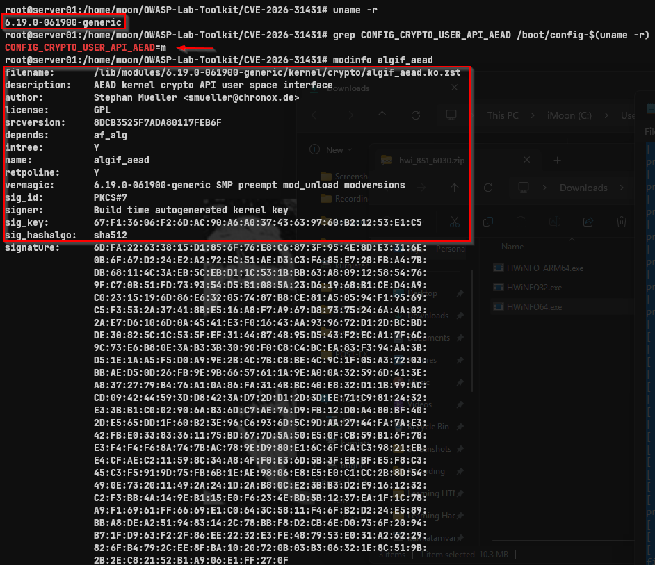
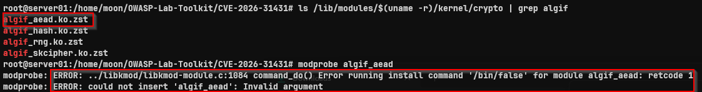
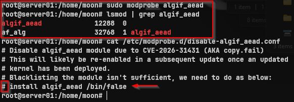

## 1. Menyiapkan Lab



Sebelum memulai pengujian, saya terlebih dahulu memverifikasi bahwa kernel yang digunakan memenuhi persyaratan untuk mereproduksi **Copy.Fail (CVE-2026-31431)**. Tahap ini bertujuan memastikan konfigurasi kernel serta modul yang diperlukan tersedia sebelum proses validasi dilakukan.

```bash
uname -r

grep CONFIG_CRYPTO_USER_API_AEAD /boot/config-$(uname -r)

modinfo algif_aead

ls /lib/modules/$(uname -r)/kernel/crypto | grep algif
```

Hasil pemeriksaan menunjukkan bahwa kernel mendukung `CONFIG_CRYPTO_USER_API_AEAD` dan modul `algif_aead` tersedia pada sistem. Kondisi tersebut memenuhi salah satu prasyarat untuk mereproduksi kerentanan di lingkungan laboratorium.

---

## 2. Memverifikasi Mitigasi



Tahap berikutnya adalah memverifikasi apakah distribusi Linux menerapkan mitigasi yang dapat memengaruhi proses reproduksi kerentanan. Pada lingkungan pengujian ini, Ubuntu masih menerapkan konfigurasi yang mencegah modul `algif_aead` dimuat secara otomatis.

```bash
modprobe algif_aead

cat /etc/modprobe.d/disable-algif_aead.conf
```

Konfigurasi tersebut menyebabkan modul tidak dapat dimuat sehingga proses reproduksi belum dapat dilanjutkan. Karena pengujian dilakukan pada lingkungan laboratorium yang terisolasi, konfigurasi mitigasi sementara tersebut disesuaikan agar kondisi sistem sesuai dengan skenario penelitian yang didokumentasikan pada CVE. Perubahan ini hanya dilakukan untuk keperluan penelitian dan tidak diterapkan pada sistem produksi.

---

## 3. Mengaktifkan Modul



Setelah konfigurasi laboratorium disesuaikan, modul `algif_aead` berhasil dimuat kembali agar kondisi sistem sesuai dengan kebutuhan pengujian.

```bash
modprobe algif_aead

lsmod | grep algif_aead
```

Verifikasi menunjukkan bahwa modul telah aktif pada kernel sehingga lingkungan laboratorium telah memenuhi kondisi yang diperlukan untuk melanjutkan proses validasi dan reproduksi **Copy.Fail (CVE-2026-31431)** pada tahap berikutnya.