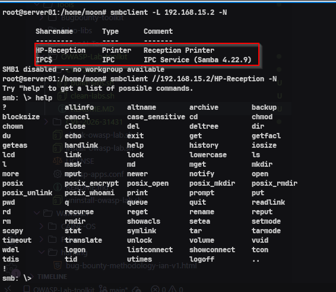
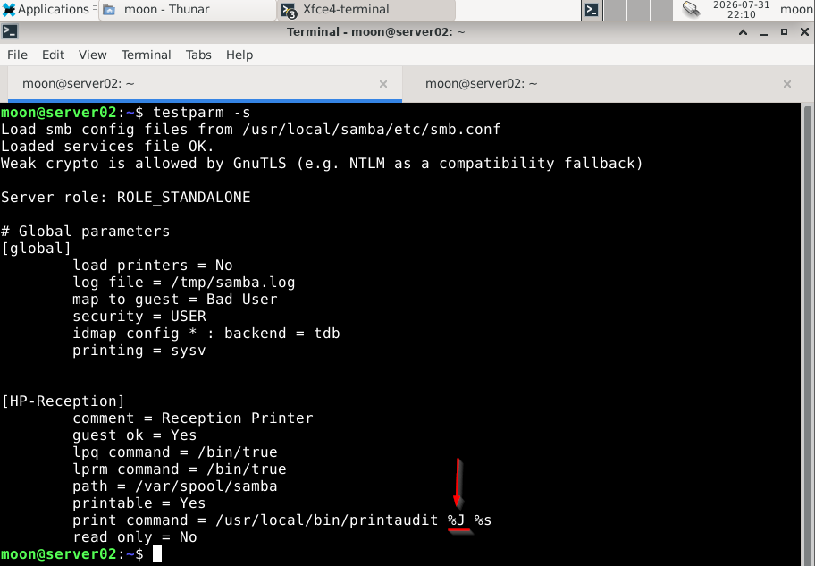
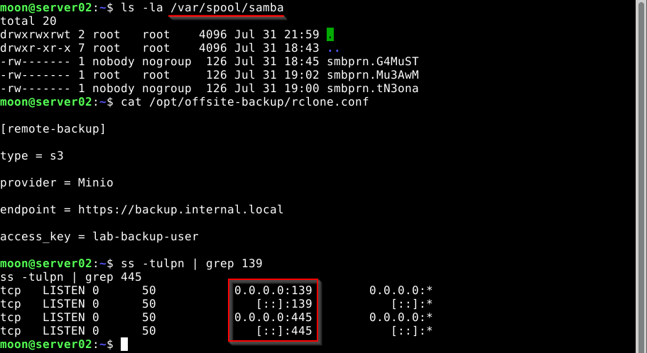

# 1. Menyiapkan Lab

Sebelum menjalankan lab, lingkungan pengujian dipersiapkan menggunakan Samba 4.22.9 dengan fitur layanan printer yang aktif.

Tahap ini bertujuan memastikan sistem memiliki konfigurasi yang sesuai untuk melakukan pengujian keamanan.

---

# 2. Verifikasi Konfigurasi Samba

Konfigurasi ini menggambarkan simulasi layanan printer jaringan pada Samba.

Beberapa pengaturan diperiksa untuk memahami bagaimana layanan menerima permintaan dari pengguna dan bagaimana proses pekerjaan printer dijalankan pada server.

Parameter `%J` menjadi bagian penting dalam analisis karena berkaitan dengan pengolahan informasi job printer pada sisi server.

---

# 3. Verifikasi Service & Process

Tahap ini memastikan layanan Samba berjalan dengan benar serta melakukan pemeriksaan terhadap layanan jaringan, proses sistem, dan komponen pendukung yang digunakan.

Validasi ini membantu memahami kondisi sistem sebelum melakukan analisis keamanan lebih lanjut.